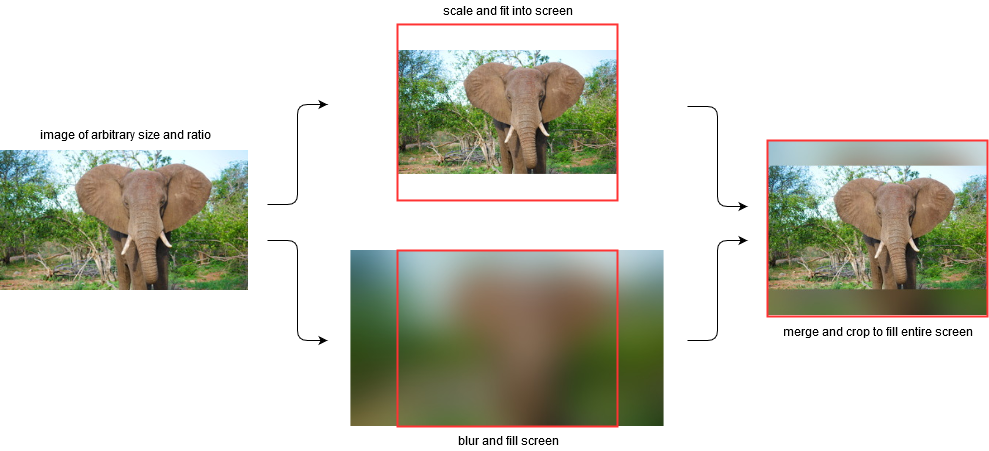

# piFrame
Raspberry Pi Picture Frame
* slideshow script for Raspberry Pi
* converts images to fit into screen
* adds blurred borders 


## Table of Contents
1. [Image conversion pipeline](#Imageconversionpipeline)
1. [Usage](#usage)


## Image conversion pipeline




## Usage
1. adapt variables in *convert-images.sh* script
1. convert images
   ``` shell script
   ./convert-images.sh
   ```
1. copy converted images on SD-card of Raspberry Pi (e.g. to /home/pi/Pictures)
1. run setup-slideshow.sh script on Raspberry Pi
   ``` shell script
   sudo ./setup-slideshow.sh
   ```
1. reboot Raspberry Pi
   * the slideshow is started automatically after reboot